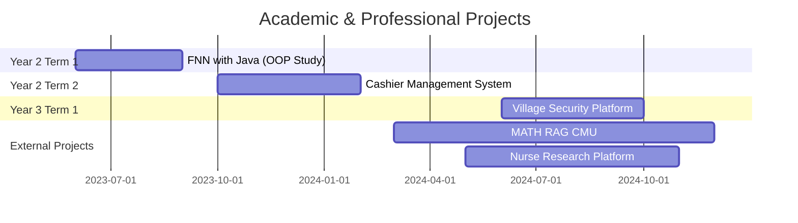

<div align="center">

# Q (Thanarak)

### Security Engineer | Full Stack Developer | AI/ML Engineer


</div>

---

## Technical Expertise

<div align="center">

### Programming Languages


### Backend Technologies


### Frontend & Styling


### AI/ML & Data


### Security & DevOps


</div>

---

## Core Competencies

```yaml
Security Engineering:
  - Application Security Architecture
  - Vulnerability Assessment & Penetration Testing
  - Secure Code Review & Threat Modeling
  - Security Automation & DevSecOps

Backend Development:
  - High-Performance APIs: Elysia (Bun), FastAPI, Flask
  - Microservices Architecture
  - RESTful API Design
  - Database Design & Optimization (PostgreSQL)
  - Systems Programming with Rust

AI & Machine Learning:
  - RAG (Retrieval-Augmented Generation)
  - LangChain Integration & Data Pipelines
  - NLP & Document Processing
  - ML Model Deployment

Full Stack:
  - Next.js Application Development
  - Server-Side Rendering & API Routes
  - Modern Frontend Architecture
  - Cloud Infrastructure (DigitalOcean, S3-compatible storage)
```

---

## Featured Projects

### 🏘️ Village Security Platform
**Role:** Scrum Master, Frontend Dashboard & Backend API Developer

[](https://github.com/Thanarak-q/Village_Security_project)

An integrated platform for managing residential communities with real-time monitoring and visitor management.

**Tech Stack:** Next.js, Bun, Elysia, Docker, PostgreSQL, DigitalOcean Spaces, Caddy, LINE LIFF

**Key Features:**
- Real-time visitor screening and notification system
- OCR-assisted ID verification
- Resident management dashboard
- LINE LIFF integration for mobile access
- Containerized deployment with Docker
- Reverse proxy with Caddy and optional Ngrok exposure

**Achievements:**
- Led team as Scrum Master coordinating frontend and backend development
- Built admin dashboard with Next.js for comprehensive community management
- Developed RESTful APIs using Elysia for high-performance data handling
- Integrated S3-compatible storage for secure document management

---

### 🍽️ Cashier Management System
**Role:** Team Leader & Frontend Developer

[](https://github.com/CSCMU66/24cs212g05)

Comprehensive point-of-sale and restaurant management system with multi-role interfaces.

**Tech Stack:** Flask, JavaScript, HTML/CSS, Docker

**Key Features:**
- Table management and reservation system
- Billing and payment processing
- Kitchen display system for order management
- Multi-role access (Staff, Kitchen, Admin)
- Admin analytics dashboard

**Achievements:**
- Led team development and coordinated task distribution
- Built responsive admin interface with vanilla JavaScript
- Designed RESTful API architecture with Flask
- Implemented role-based access control system

---

### 🤖 MATH RAG CMU
**Role:** RAG Developer & Data Pipeline Engineer

Advanced Retrieval-Augmented Generation system for mathematical content processing.

**Tech Stack:** FastAPI, LangChain, Docker, Vector Databases

**Key Features:**
- Custom RAG pipeline for mathematical document retrieval
- Vector embedding optimization for academic content
- High-performance API with FastAPI
- Automated data ingestion pipeline

**Achievements:**
- Designed and implemented end-to-end RAG architecture
- Built scalable data processing pipelines with LangChain
- Optimized vector search for mathematical notation
- Deployed containerized solution with Docker

---

### 🏥 Nurse Research Data Platform
**Role:** Full Stack Developer

[]()

Web application for collecting and managing nursing research data with LINE OA integration.

**Tech Stack:** Next.js, LINE OA API

**Key Features:**
- Research data collection interface
- LINE Official Account integration for notifications
- Responsive design for mobile and desktop
- Secure data storage and retrieval

---

### 🧠 Basic Feedforward Neural Network in Java
**Role:** Developer

[](https://github.com/MI9000/Basic-FNN-with-JAVA)

Educational project exploring object-oriented programming principles through neural network implementation.

**Tech Stack:** Java, OOP Design Patterns

**Key Features:**
- Pure Java implementation of feedforward neural network
- Object-oriented architecture for network layers
- Training algorithm implementation
- Educational codebase demonstrating OOP concepts

---

## GitHub Statistics

<div align="center">


</div>

---

## Technology Stack Breakdown

<div align="center">

| Category | Technologies |
|----------|-------------|
| **Languages** | Rust, Python, JavaScript/TypeScript, Go, C, C++, Java |
| **Backend** | Elysia (Bun), FastAPI, Flask, Express.js |
| **Frontend** | Next.js, React, Tailwind CSS, HTML5/CSS3 |
| **AI/ML** | LangChain, RAG, TensorFlow, PyTorch |
| **Security** | OWASP, Penetration Testing, AppSec |
| **DevOps** | Docker, Kubernetes, CI/CD, Linux, Caddy |
| **Databases** | PostgreSQL, MongoDB, Redis, Vector DBs |
| **Cloud** | DigitalOcean, S3-compatible storage |

</div>

---

## Professional Focus

<table>
<tr>
<td width="50%">

### Security Engineering
- Building secure-by-design systems
- Automated security testing
- Threat intelligence integration
- Zero-trust architecture

</td>
<td width="50%">

### AI/ML Development  
- RAG system implementation
- LangChain orchestration
- Custom ML pipelines
- Production AI deployment

</td>
</tr>
<tr>
<td width="50%">

### Backend Development
- High-performance APIs with Rust & Bun
- Microservices architecture
- Real-time data processing
- Scalable system design

</td>
<td width="50%">

### Full Stack
- Next.js applications
- Modern web architecture
- Performance optimization
- Cloud-native solutions

</td>
</tr>
</table>

---

## Project Timeline



---

## Skills Progression

<div align="center">

**Systems Programming & Performance**
```rust
// Building high-performance systems with Rust
fn main() {
    println!("Security + Performance = Production Ready");
}
```

**Full Stack Development**
```typescript
const expertise = {
  frontend: ["Next.js", "React", "TypeScript"],
  backend: ["Elysia/Bun", "FastAPI", "Flask"],
  database: ["PostgreSQL", "Vector DBs"],
  deployment: ["Docker", "Cloud Infrastructure"]
};
```

**AI/ML Engineering**
```python
# RAG Development & Data Pipelines
from langchain import LangChain
from fastapi import FastAPI

# Building production-ready AI systems
```

</div>

---

## Current Work

```typescript
const currentFocus = {
  position: "Security Engineer & Full Stack Developer",
  activeProjects: [
    "Village Security Platform - Production deployment",
    "MATH RAG CMU - RAG optimization",
    "Nurse Research Platform - Feature expansion"
  ],
  focus: [
    "Application security architecture",
    "High-performance backend systems with Rust",
    "RAG-powered AI applications",
    "Security automation with AI/ML"
  ],
  learning: [
    "Advanced Rust systems programming",
    "Cloud security architecture", 
    "MLOps for production AI systems",
    "Kubernetes orchestration"
  ]
};
```

---

## Connect

<div align="center">

[](https://linkedin.com/in/yourprofile)
[](mailto:your.email@example.com)
[](https://github.com/Thanarak-q)

</div>

---

<div align="center">

### Code Quality Metrics


---

**"Security is not a product, but a process"**

*Building secure, scalable systems with modern technology*

**From Student Projects to Production Systems**

</div>
